# Object
### The Object type represents one of JavaScript's data types. It is used to store various keyed collections and more complex entities. Objects can be created using the Object() constructor or the object initializer / literal syntax.

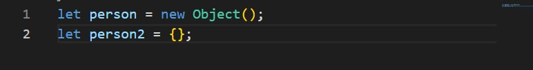

### person is a Object, name: is a keys and "Shahrom" is a Values

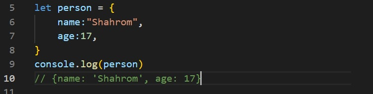

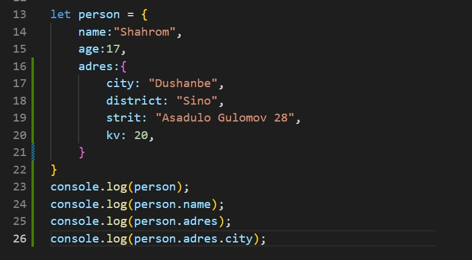

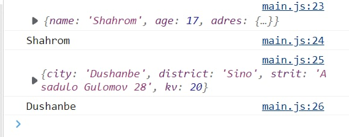
#
#

# Object methods
#
## Method Object.entries()
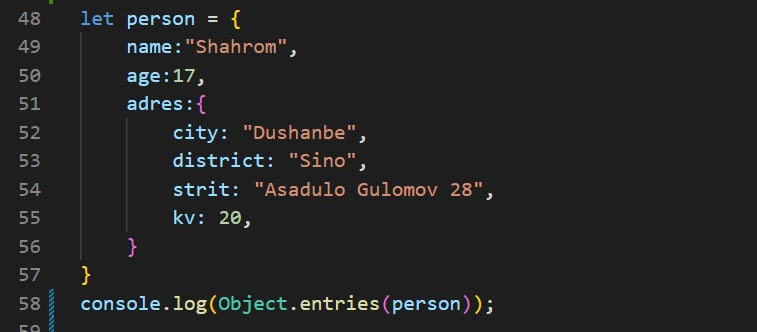

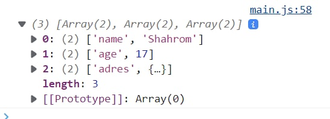
#
#

## Method Object.keys()
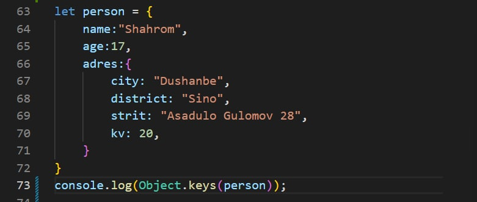

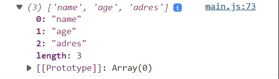
#
#

## Method Object.values()

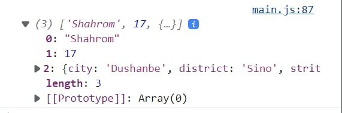
#
#

# Destructuring and spread
#
# Destructuring
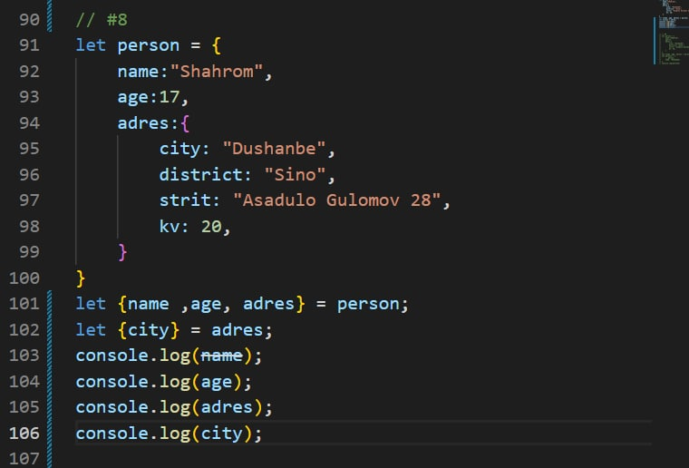

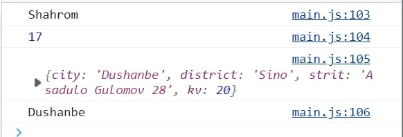
#
#

# Spread
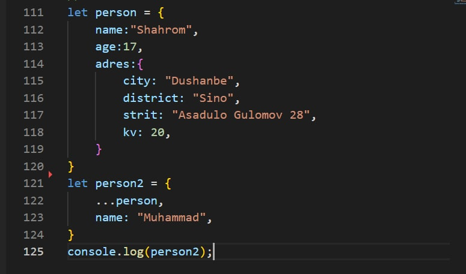

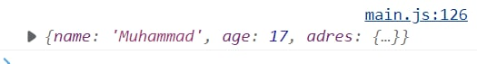